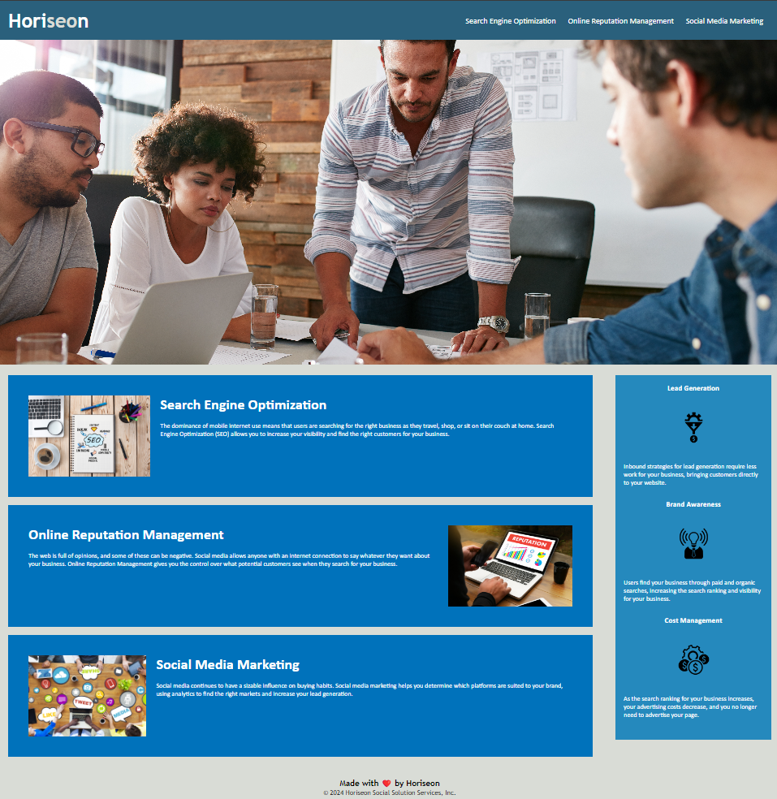

# Readme.md for Week 1 Challenge

## Description

This is my readme file for the week 1 challenge. We are to refactor the existing starter code to include accessibility standards, semantic HTML elements, and logical HTML structure.

Added alt text to all images to meet accessibility standards and in case the image fails to load.

Changed all divs to the relevant semantic elements (header, nav, footer, section, main, and aside).

Changed relevant classes to id's if they have unique elements.

Consolidated CSS selectors and properties where possible to reduce repeated code.

The HTML structure now follows a logical order of: header->main->footer

The title element now has a relevant description of the company.

class="search-engine-optimization" changed to id="search-engine-optimization" to fix a broken link.

## Screenshot

## Link to deployed Application

<a href="https://rp192w.github.io/horiseon-refactor/">https://rp192w.github.io/horiseon-refactor/</a>